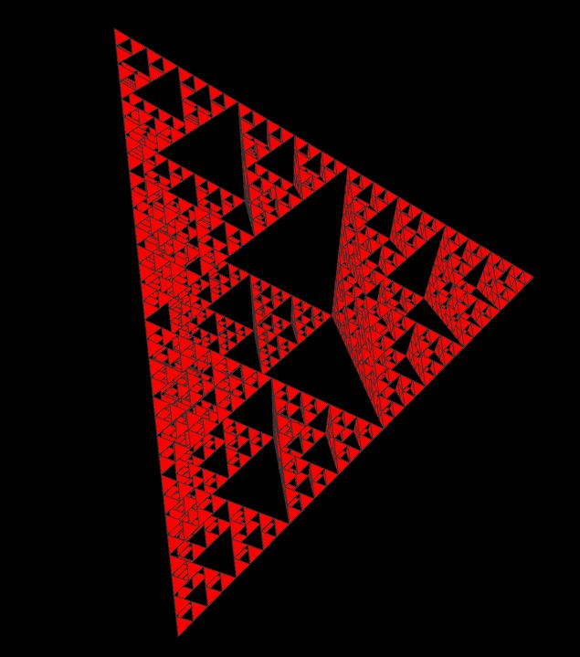

# Tetrahedron-Gasket
Sierpinski Gasket using Tetrahedrons in Processing
Here's all the code necessary to make tetrahedrons in processing's Python mode and it can easily be translated (pun intended) to other Processing modes.

